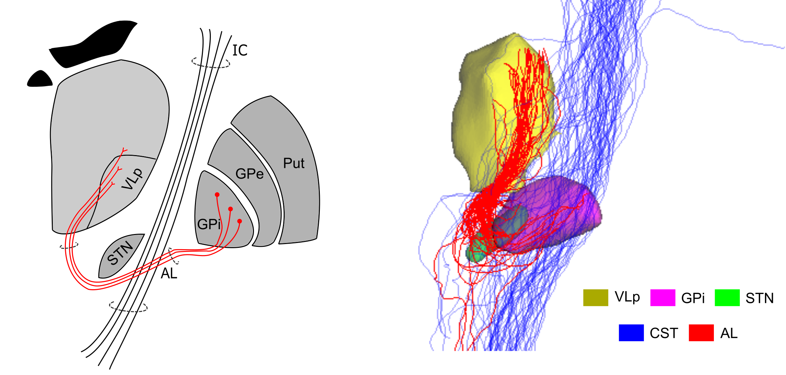

# Subcortico-subcortical connectivity



This repository holds the Jupyter notebooks for assessing subcortico-subcortical connectivity identified
via tractography. Within each notebook, there are related functions to load the files, process the data as 
necessary, create figures and view tractography in 3D via `DIPY`.  All notebooks are linted with `Black` 
prior to saving. A full list of imported libraries can be found at the end of each notebook. 


_Note: The embedded table of contents does not work on Github or `jupyter lab` (which
has its own table of contents module). It does however work in `jupyter notebook`_

Every time the notebooks are updated, this repository will also be updated! If the notebook cannot 
be loaded on Git, you may need to try again in a bit.

## Accessing the data

The minimally preprocessed data is made available from the Human Connectome Project. The processed will
be made available through the Federated Research Data Repository (FRDR) - **link coming soon**! 

## Processing workflow

The processing workflow is currently being developed into a [Snakebids](https://github.com/akhanf/snakebids/) 
workflow for ease of use. Example scripts used for processing the original data can be found in the following
repository: https://github.com/kaitj/dbsc. Transformations can also be found in this repository.

## Environment

If you are accessing the notebooks on a local copy or on `Graham` you will need to set up the 
virtual environment to be able to run the code cells. The easiest and recommended way to do this
is via `poetry` (v1.2.0a2). You set up the environment with the following command:

```
poetry install --with analysis
poetry run python -m ipykernel install --user --name=subcortical_py3
```

After installing the required libraries, fire up a Jupyter instance with the following command
`poetry run jupyter lab`. Make sure you select the `subcortical_py3` kernel installed!

If you prefer to set up a virtual Python environment (preferably Python 3.7). 
You can use the following block of code to create the necessary virtual environment.

```
# Load Python module if on Graham / CBS
# This is not necessary if running on a personal computer
module load python/3.7

# Replace <venv_dir> with the path to set up the environment
python -m venv <venv_dir> 
source <venv_dir>/bin/activate

# This will install all the necessary libraries into the environment.
pip install -r <requirements.txt>

# Install jupyter and jupyter lab 
pip install jupyter jupyterlab
python -m ipykernel install --user --name=subcortical_py3
```

### Installation notes
If you are trying to create a multipanel figure to perform QC across subjects,
`matplotlib` will need to be upgraded from `3.3.4` to `3.4.3` (this will break some functionality in
analysis notebooks).

If you are using Poetry, you can edit version listed in `pyproject.toml` from `~3.3.4` to `~3.4.3`. 
After updating, run `poetry update`. You can then run the JupyterLab as before.

If you are using a virtual Python environment, it is easiest to create a new environment. Follow the
instructions above, replacing `pip install -r requirements.txt` with 
`pip install -r  requirements_multipanel.txt`
